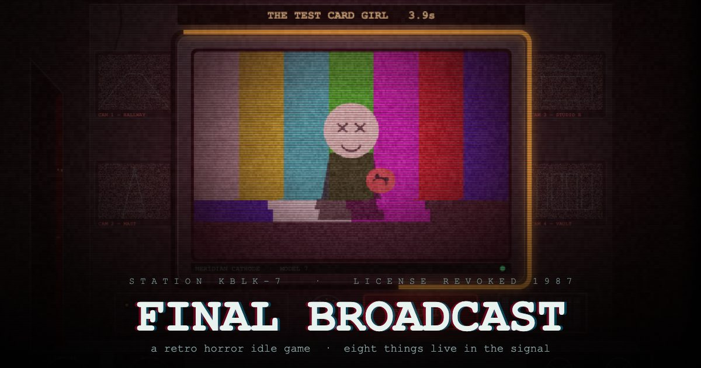

# FINAL BROADCAST

**[▶ Play in your browser](https://jasraajdevz.github.io/final-broadcast/)**



You have the night shift at KBLK-7, a station that lost its licence in 1987 and never
quite stopped transmitting. Keep the carrier up. Keep the numbers climbing. And when
something gets into the feed, cut it out before it looks back.

A retro horror idle game in a single HTML file. No build step, no dependencies, no
assets, no network calls — every frame is procedural `<canvas>`, every sound is
synthesised WebAudio.

---

## The shift

The clock starts at **23:00 and you are trying to reach 06:00.** Nobody has ended a shift
since 1987.

The night is seven named segments — STATION IDENT, THE LATE MOVIE, OVERNIGHT NEWS, THE
DEAD HOUR, TEST TRANSMISSION, THE CHOIR HOUR, SIGN-OFF PREP — and each one has a viewer
quota. The clock runs freely to :59 and then **holds** until you make quota. Fall behind
and time stops, dread creeps, and the anomalies start arriving almost twice as fast.
Banishing is the quickest way to make quota, which is what ties the two halves together.

Reach 06:00 and the test card comes up on its own.

## The loop

**The idle half.** Nothing is automatic at first — the carrier will not hold itself, so
you **strike the set** to keep signal going out. That buys transmitters, transmitters
generate SIGNAL passively, reach converts into SUBSCRIBERS, and subscribers multiply
signal output. Ten tiers, from a bent coat hanger to something that is not a transmitter
at all, plus one-time station equipment. Surviving to dawn banks permanent RATINGS POINTS.

**The panic half.** Every eleven to twenty-seven seconds, something manifests on the main
tube. It telegraphs first — the security cameras catch a silhouette a beat before it
takes the screen. Then a ring starts draining around the bezel.

**Each anomaly dies to exactly one of the eight emergency-broadcast keys.**

Right key: banished, signal bonus, streak up. Wrong key: the clock jumps forward.
Clock out: jumpscare, and it leaves with a piece of your numbers. Fill the DREAD meter
and you lose the signal entirely.

## The eight

    THE SNOW CRAWLER          MR. SLEEPWELL          THE VERTICAL MAN
    DEAD AIR                  THE TEST CARD GIRL     THE RERUN
    THE NIELSEN               THE CALLER

Which button kills which is not written down here on purpose.

The **operator's field manual** (`M`) writes each page the first time a thing reaches
your monitor — how it presents, what the station knows about it, the procedure, and the
one countermeasure that works. Before that the page is blank. First encounters get a
longer window so you can read under fire, and opening the manual mid-attack jumps
straight to whatever is currently on your screen.

You are meant to learn these the hard way. That is the game.

Deeper in, MASKED signals start appearing: cut the feed to strip the mask, *then*
counter what is underneath. You have about a second and a half to do both.

## Sponsorships

The station takes commercial breaks. These are rendered in-game 1980s spots — Sleepwell
Brand Night Tonic, "one spoonful and the dreams stop" — about six seconds, skippable
after five. Taking one grants ×3 output for a minute. Taking one on SIGNAL LOST buys the
rest of the hour and keeps everything you own.

Nothing external is ever loaded or contacted. The commercials are part of the fiction.

## Controls

| | |
|---|---|
| click the tube | strike the set — holds the carrier, makes signal |
| `1` – `8` | the eight emergency-broadcast keys |
| `M` | operator's field manual |
| `Esc` | close |

The keys are also buttons — it plays fine with a mouse or by touch.

**Wear headphones.** The room has a floor: an air handler two storeys down, three
resonant modes of an empty concrete studio, wind past the mast, pipes, joists, doors you
did not open, and voices you will not quite catch. A heartbeat comes up under the banish
timer and accelerates to 172 bpm as it drains. Miss one and something screams.

## Running it

Any static host, or just open the file:

```bash
git clone https://github.com/jasraajdevz/final-broadcast.git
open final-broadcast/index.html
```

Progress autosaves to `localStorage`. The STATION tab has a volume slider and a toggle
for the harsh flashing and RGB tearing, which is on by default because the effect is
load-bearing for the horror — turn it off if you need to.

## License

MIT. See [LICENSE](LICENSE).
